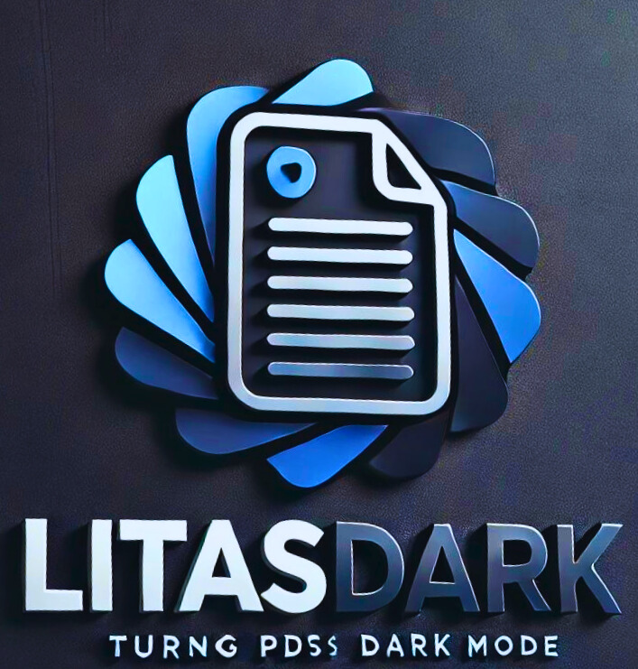

# LitasDark: PDF Dark Mode Converter



LitasDark is a user-friendly web application designed to convert your PDF files to dark mode. It provides a simple interface to upload PDF files, preview them, and convert them with customizable dark mode settings.

## Features

- **PDF Upload**: Easily upload PDF files for conversion.
- **Dark Mode Themes**: Choose from three dark mode themes - Dark, Darker, and Darkest.
- **Brightness and Contrast Adjustment**: Fine-tune the brightness and contrast of the converted PDF.
- **Real-time Preview**: Generate a preview of the PDF in dark mode before conversion.
- **Download Converted PDF**: Download the converted PDF file with a single click.

## Getting Started

Follow these instructions to set up the project locally.

### Prerequisites

- Web browser (Chrome, Firefox, Safari, etc.)

### Installation

1. **Clone the repository:**
    ```bash
    git clone https://github.com/your-username/litasdark.git
    ```
2. **Navigate to the project directory:**
    ```bash
    cd litasdark
    ```
3. **Open `index.html` in your web browser:**
    ```bash
    open index.html
    ```

## Usage

1. **Upload a PDF File:**
    - Click on the "Upload PDF" input and select a PDF file from your computer.

2. **Choose Theme:**
    - Select one of the dark mode themes from the dropdown menu: Dark, Darker, or Darkest.

3. **Adjust Brightness and Contrast:**
    - Use the sliders to adjust the brightness and contrast settings to your preference.

4. **Generate Preview:**
    - Click on the "Generate Preview" button to see a preview of the PDF in dark mode.

5. **Convert to Dark Mode:**
    - Once satisfied with the preview, click the "Convert to Dark Mode" button to apply the changes to the entire PDF.

6. **Download Converted PDF:**
    - Click on the "Download Converted PDF" link to download the modified PDF file.


